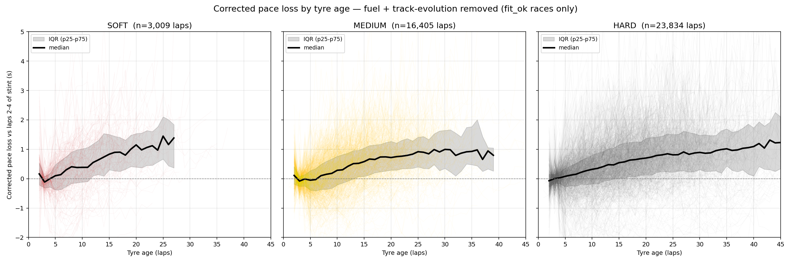
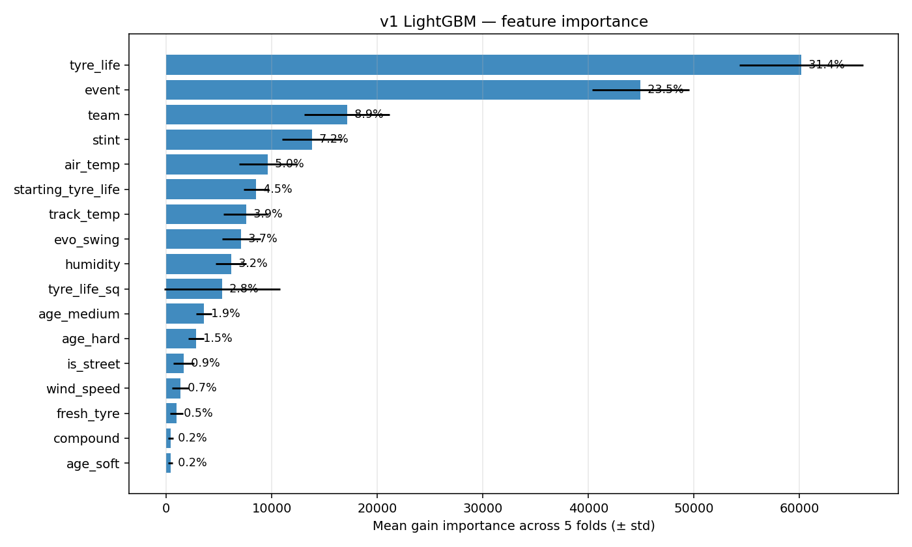
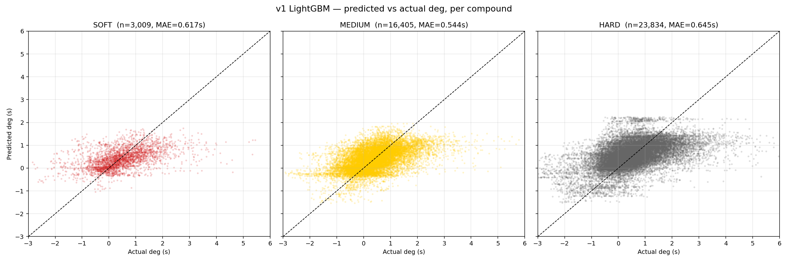
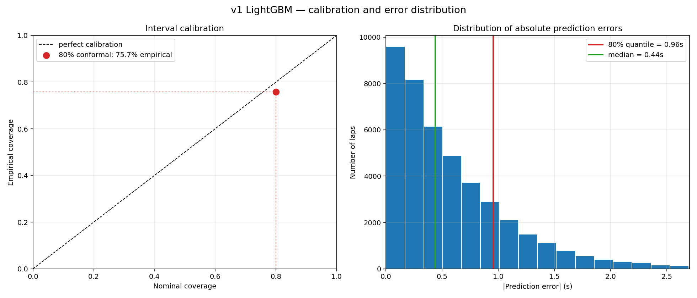
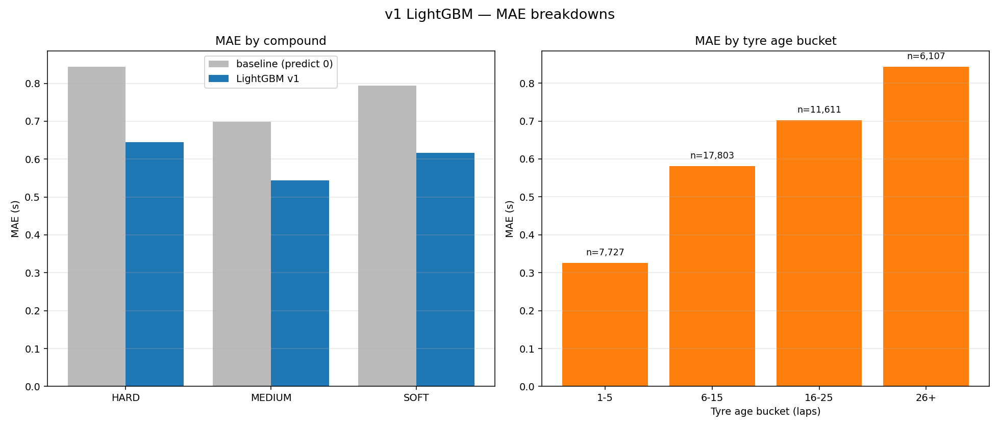
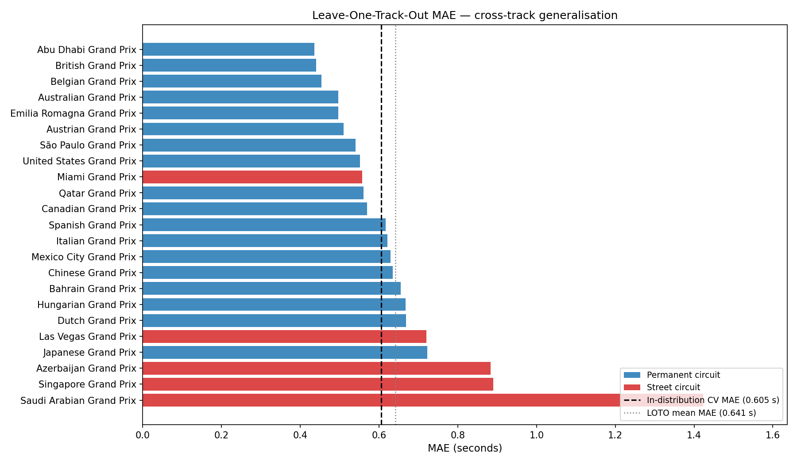
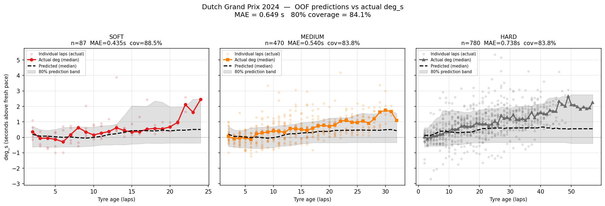

# F1 Tyre Degradation Model

End-to-end pipeline for modelling F1 tyre pace loss from raw timing data. Raw laps → fuel/track-evolution correction → two degradation models → race strategy simulator.

---

## Pipeline overview

```text
FastF1 API
    └─ scripts/build_dataset.py       raw lap filtering → data/laps_clean.parquet
        └─ scripts/correct_all_races.py   fuel + track-evo correction → data/laps_corrected.parquet
            ├─ model/train_lgbm.py         v1 LightGBM + conformal intervals
            ├─ model/train_lgbm_quantile.py  v1b CQR quantile model  ← primary
            ├─ model/train_bayesian.py     v2 hierarchical Bayesian (PyMC)
            ├─ model/eval_temporal.py      temporal holdout: 2023-24 → 2025
            ├─ model/eval_loto.py          leave-one-track-out generalisation
            └─ model/strategy_sim.py       race strategy simulator
```

---

## Dataset

|                            |                    |
| -------------------------- | ------------------ |
| Seasons                    | 2023, 2024, 2025   |
| Raw laps                   | 58,970             |
| Races                      | 62                 |
| Races passing quality gate | 53 / 62            |
| Fit-ok laps                | 51,437             |
| Tracks                     | 23                 |
| Drivers                    | 28                 |
| Compounds                  | SOFT, MEDIUM, HARD |

### Quality gate (`fit_ok`)

Each race is fit with an OLS model `laptime ~ driver + lap_n + lap_n² + age:compound`. A race passes if:

- R² ≥ 0.50
- Residual RMSE ≤ 1.0 s
- `beta_lap_n > −0.10` (rules out races where the correction absorbed tyre deg into a physically implausible negative track-trend)

9 races fail, mostly Monaco, Singapore 2023, and Azerbaijan 2025 — SC-heavy races with heavily distorted lap time distributions.

---

## Target: `deg_s`

Raw lap time → remove fuel load (0.056 s/lap) → fit quadratic track-evolution curve → subtract per-stint fresh reference (mean of laps 2–4):

```text
deg_s = pace_loss_s − stint_ref_pace
```

`deg_s` is zero at fresh tyres and increases as the tyre ages. Mean ≈ 0.40 s, std ≈ 1.1 s.



---

## Confounder treatment

The target `deg_s` is the degradation component after removing these confounders. Each is treated explicitly:

| Confounder           | Treatment                                                                                                                                                                                                                                                                                  |
| -------------------- | ------------------------------------------------------------------------------------------------------------------------------------------------------------------------------------------------------------------------------------------------------------------------------------------ |
| **Fuel burn**        | Fixed correction of 0.056 s/lap (0.035 s/kg × ~1.6 kg/lap burn rate) applied before fitting. Removes the downward slope that would otherwise contaminate deg estimates in early laps.                                                                                                      |
| **Track evolution**  | Per-race quadratic OLS fit on `lap_n + lap_n²` across all drivers. The fitted trend is subtracted from every lap. Races where the fit implies an implausible negative slope are excluded by the quality gate.                                                                              |
| **In/out laps**      | Excluded during `build_dataset.py` via `PitInTime` / `PitOutTime` flags.                                                                                                                                                                                                                   |
| **Safety car / VSC** | Filtered using `TrackStatus != '1'`. Races with residual SC contamination fail the R²/RMSE quality gate and are excluded.                                                                                                                                                                  |
| **Traffic**          | No direct signal available in public FastF1 data. Proxied by the lap-time outlier filter (> 110% of driver's stint median) which removes the most egregious traffic laps. Remaining traffic is accepted as noise; it increases variance but does not systematically bias the deg estimate. |
| **Driver push/save** | Unobservable in public data — drivers deliberately lift without any telemetry flag. Treated as irreducible noise. The per-stint reference normalization (subtracting laps 2–4 mean) absorbs most of the per-driver baseline; lap-to-lap push/save variation remains in the residual.       |
| **Driver effect**    | Absorbed partly by the per-stint reference normalization and partly by the `team` feature in the model. Individual driver intercepts are not modelled separately; the team proxy is sufficient given the small within-team driver variance on tyres.                                       |
| **Used sets**        | Captured by `starting_tyre_life` (the minimum tyre age at stint start). A tyre starting at age 8 degrades differently from one starting at age 1 even at the same current age.                                                                                                             |

---

## Models

### v1b — Conformalized Quantile Regression (CQR) ← primary model

Same features as v1. Three LightGBM models per fold: MAE point estimate, lower quantile (α/2), upper quantile (1−α/2). The CQR nonconformity score `max(q_lo − y, y − q_hi)` calibrates interval width. The resulting intervals are **adaptive (heteroskedastic)** — narrower early in a stint, wider at high tyre age — with a formal coverage guarantee.

#### Results (5-fold CV)

| Metric               | Value       |
| -------------------- | ----------- |
| OOF MAE              | **0.630 s** |
| Baseline (predict 0) | 0.785 s     |
| Improvement          | 19.8%       |
| 80% coverage         | 77.6%       |
| Interval width       | 1.802 s     |

CQR produces adaptive (heteroskedastic) interval widths — narrower early in a stint, wider at high tyre age. This is the model used for the worked example and strategy simulator.

---

### v1 — LightGBM + split-conformal intervals

Symmetric split-conformal intervals: `[ŷ − q_α, ŷ + q_α]`. Simpler than CQR but produces constant-width bands regardless of tyre age.

#### Features

| Feature            | Importance |
| ------------------ | ---------- |
| tyre_life          | 31.4%      |
| event (track)      | 23.5%      |
| team               | 8.9%       |
| stint number       | 7.2%       |
| air_temp           | 5.0%       |
| starting_tyre_life | 4.5%       |
| track_temp         | 3.9%       |
| evo_swing          | 3.7%       |
| humidity           | 3.2%       |
| tyre_life²         | 2.8%       |
| is_street          | 0.9%       |
| compound           | 0.2%       |

`compound` ranks low because `deg_s` is stint-referenced. The compound effect lives in the _shape_ of the curve, captured by `age_soft/medium/hard` interaction features and the track embedding.



#### Results — v1 (5-fold CV)

| Metric               | Value   |
| -------------------- | ------- |
| OOF MAE              | 0.605 s |
| Baseline (predict 0) | 0.785 s |
| Improvement          | 22.9%   |
| 80% coverage         | 75.7%   |
| Interval width       | 1.713 s |

By compound:

| Compound | n      | MAE     | 80% Coverage |
| -------- | ------ | ------- | ------------ |
| SOFT     | 3,009  | 0.617 s | 76.2%        |
| MEDIUM   | 16,405 | 0.544 s | 79.3%        |
| HARD     | 23,834 | 0.645 s | 73.3%        |





---

### v2 — Hierarchical Bayesian (PyMC)

Non-centred parametrisation with partial pooling: per-(track, compound) deg slopes share compound-level priors. Handles unseen tracks via prior fallback. Student-T likelihood for robustness to outliers.

```text
beta[track, compound] ~ HalfNormal(mu_beta[compound], sigma_beta[compound])
alpha[track, compound] ~ Normal(0, sigma_alpha)
delta[team]            ~ Normal(0, sigma_team)
gamma[compound]        ~ Normal(0, 0.02)

mu = alpha[t,c] + (beta[t,c] + delta[team]) * age + gamma[c] * (temp−30) * age/30
y  ~ StudentT(nu, mu, sigma_obs)
```

20k-lap subsampling per fold to keep fit times tractable (~4–6 min/fold, 2 chains).

| Metric         | v1b CQR     | v2 Bayesian |
| -------------- | ----------- | ----------- |
| OOF MAE        | **0.630 s** | 0.677 s     |
| 80% coverage   | 77.6%       | 72.2%       |
| Interval width | 1.802 s     | 1.727 s     |
| Total fit time | —           | 1,389 s     |

LightGBM wins on MAE and coverage. Bayesian undercoverage is partly due to subsampling — the posterior underestimates uncertainty with fewer training laps.

---

## Temporal holdout: 2023–2024 → 2025

Train on 34 races (2023–24), test on 19 races (2025). The model is fit entirely on pre-2025 data.

| Metric       | CV (5-fold) | Temporal 2025 |
| ------------ | ----------- | ------------- |
| MAE          | 0.605 s     | 0.633 s       |
| Baseline     | 0.785 s     | 0.757 s       |
| Improvement  | 22.9%       | 16.4%         |
| 80% coverage | 75.7%       | 75.8%         |

8% MAE degradation season-to-season. Coverage holds, which means the conformal calibration generalises to a new season.

### Per-track MAE (2025 test set)

| Track             | n         | MAE         | Coverage  |
| ----------------- | --------- | ----------- | --------- |
| Emilia Romagna GP | 821       | 0.457 s     | 88.9%     |
| Abu Dhabi GP      | 1,048     | 0.466 s     | 85.9%     |
| Canadian GP       | 1,084     | 0.472 s     | 86.4%     |
| Qatar GP          | 922       | 0.487 s     | 82.8%     |
| USGP              | 707       | 0.533 s     | 84.0%     |
| …                 |           |             |           |
| Hungarian GP      | 1,289     | 0.708 s     | 73.9%     |
| Japanese GP       | 997       | 0.872 s     | 57.7%     |
| **Singapore GP**  | **1,069** | **1.093 s** | **46.9%** |

Singapore and Japan are persistent outliers. At Singapore, `deg_s` has only r=0.49 correlation with tyre age (vs r=0.59 at Austria) — the correction model absorbs real degradation signal into track-evolution noise at street circuits with heavy safety car activity.

---

## Cross-track generalisation: leave-one-track-out

`model/eval_loto.py` trains on all tracks except one, tests on the held-out track, and repeats for every track. This measures how much the model degrades when it has never seen a given circuit.

For the held-out track the `event` categorical feature falls back to the most common training track — the model can still use tyre age, temperature, team, and is_street to make predictions.



| Metric                             | Value         |
| ---------------------------------- | ------------- |
| In-distribution MAE (5-fold CV)    | 0.605 s       |
| LOTO mean MAE (all tracks)         | 0.641 s       |
| MAE degradation vs in-distribution | +0.036 s (6%) |
| LOTO mean MAE (permanent circuits) | 0.571 s       |
| LOTO mean MAE (street circuits)    | 0.895 s       |
| Mean 80% coverage (LOTO)           | 79.1%         |

Street circuits show the largest LOTO penalty: the `is_street` flag gives some signal but much of what the model learns about Monaco or Singapore is track-specific behaviour that cannot be inferred from other circuits.

---

## Per-compound ablation

Three separate per-compound models vs one joint model:

| Model                           | OOF MAE     |
| ------------------------------- | ----------- |
| Joint LightGBM (v1b CQR)        | **0.630 s** |
| Per-compound (SOFT/MEDIUM/HARD) | 0.633 s     |

The joint model wins by borrowing cross-compound track information. A track that degrades tyres hard in general affects all compounds — the joint model learns this; per-compound models can't.

---

## Worked example

`scripts/worked_example.py` picks the richest race from the out-of-fold predictions and plots predicted vs actual `deg_s` per compound, with the 80% prediction band overlaid on individual lap scatter. The selected race is **Dutch Grand Prix 2024** — all three compounds present, 1,337 laps, long hard stints.



| Compound | n     | MAE     | 80% coverage |
| -------- | ----- | ------- | ------------ |
| SOFT     | 87    | 0.435 s | 88.5%        |
| MEDIUM   | 470   | 0.540 s | 83.8%        |
| HARD     | 780   | 0.738 s | 83.8%        |
| Overall  | 1,337 | 0.649 s | 84.1%        |

**Where the model agrees**: coverage is strong across all three compounds (84% overall), and the predicted slope direction is correct for every compound — deg_s rising with tyre age as expected.

**Where it struggles**: the model systematically under-predicts the degradation rate at Zandvoort. The actual slopes (+0.071 s/lap SOFT, +0.051 s/lap MEDIUM, +0.040 s/lap HARD) are 2–3× steeper than predicted. Zandvoort is an abrasive, high-lateral-load circuit; the model has limited data on it (2023 and 2024 races only) and the corrected deg signal has high variance. The largest single-lap errors reach 3–5 s, driven by a handful of laps where drivers clearly pushed hard on old tyres late in stints — the push/save confounder noted in the dataset caveats.

---

## Strategy simulator

`model/strategy_sim.py` compares tyre strategies by predicting cumulative pace loss per stint.

### Example — British Grand Prix, Mercedes

| Strategy                  | Tyre deg | Pit loss | Total       |
| ------------------------- | -------- | -------- | ----------- |
| 1-stop: HARD → MEDIUM     | +17.6 s  | +22 s    | **+39.6 s** |
| 1-stop: MEDIUM → HARD     | +20.5 s  | +22 s    | +42.5 s     |
| 2-stop: MED → HARD → SOFT | +16.5 s  | +44 s    | +60.5 s     |
| 2-stop: SOFT → MED → HARD | +16.7 s  | +44 s    | +60.7 s     |

1-stop strategies dominate once the 44 s double-pit penalty is included. HARD→MEDIUM beats MEDIUM→HARD because the hard compound degrades slowest when fresh — it's more valuable at the start of a stint than at the end.

```python
from model.strategy_sim import load_model, simulate

model, meta = load_model()
laps = simulate(
    model, meta,
    track="British Grand Prix",
    team="Mercedes",
    stints=[("HARD", 28), ("MEDIUM", 30)],
)
print(laps.groupby("stint")["pred_deg_s"].agg(["mean", "sum"]))
```

---

## Known failure modes

- **Street circuits** (Monaco, Singapore, Azerbaijan): safety car activity corrupts the track-evolution correction, making deg_s noisy. LOTO and temporal MAE are both ~2× the permanent-circuit average at these venues.
- **High tyre age (>30 laps)**: training data is sparse due to censoring. Uncertainty bands widen appropriately but point estimates are less reliable.
- **First 1–2 laps of a stint**: tyre warm-up is confounded with driver push; the model sees this as noise and regresses toward zero.
- **2025 regulation changes**: if Pirelli compound spec or car performance changes significantly, the model may need retraining. The 8% temporal MAE increase (0.602→0.633 s) suggests limited but non-zero drift year-to-year.
- **Out-of-distribution teams**: unseen team/track combinations fall back on the average team behaviour. The Bayesian v2 handles this more gracefully via partial pooling.

---

## Reproduce

```bash
python -m venv .venv && source .venv/bin/activate
pip install -r requirements.txt

make all          # fetch data → train → eval → plots (~30 min + FastF1 cache warm-up)

# Or step by step:
make data         # build_dataset.py + correct_all_races.py
make train        # v1, v1b, per-compound models
make train-bayesian  # v2 Bayesian (~25 min)
make eval         # evaluate_model.py, eval_temporal.py, eval_loto.py
make plots        # all figures including worked example
make strategy     # strategy simulator output
```

Data and model artefacts are gitignored (`data/`, `cache/`). Re-running `build_dataset.py` with a warm FastF1 cache takes ~2 min; the first run fetches ~500 sessions and takes 20–40 min depending on connection speed.
